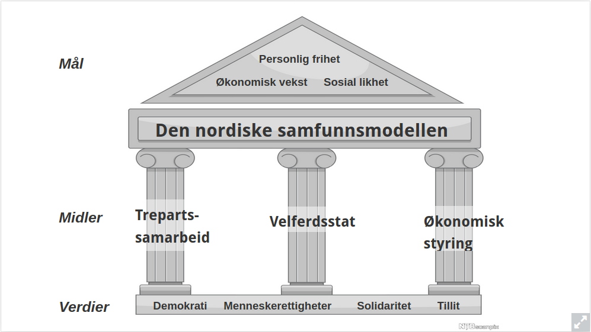

Den nordiske modellen

**YS er en alternativ fagforeningsorganisasjon som er partiuavhengi, den ble siftet i 1977.**

## Samarbeidsprinsippet
Den nordiske modellen bygger i stor grad på sammarbeid og solidaritet. F.eks. under 1930-tallets krise samarbeidet flere grupper om å innføre tiltak som var bedre for økonomien i helthet, påtross av at disse kanskje kunne få alvorlige negative konsekvenser for gruppen individuelt. **F.eks. metallindustrien gikk dårlig på 1930 tallet pga. lave internasjonale priser, mens byggebransjen som ikke var avhengig av eksport på den samme måten gikk godt. De to bransjene ble dog enig om en generell senkning av lønnsnivået for å beskytte den Norske økonomien som helhet.**

## Trepartssamarbeidet
De store samfunnskonfliktene som ga grobrunn til facismen og kommunismen på 1800 og 1900 tallet ble i Norge løst med trepartssamarbeidet, grunnprinsippene ble etablert i **hovedavtalen 1935**. Trepartsamarbeidet bygger på sammarbeid mellom næringslivet og arbeiderne. Og isteden for å ha en minstelønn bestemmes lønnsnivået i de forskjellige industriene av tariffavtaler som forhandles frem mellom de representative delene av NHO og LO(eller andre fagforeninger).

## Velferdstaten
Velferdstaten sørger for at alle har lik mulighet for å delta i arbeidslivet. Lånekassen, NAV og helsevesenet er viktige deler av velferdsstaten. For å finansiere den store velferstaten i Norge brukes høye skatter og avgifter, som igjen er avhengig av det gjenomsnittelige høye lønnsnivået vi har i Norge som et devist resultat av **trepartssamarbeidet**.

## Økonomisk styring
Staten har en sterk rolle i å regulere den Norske økonomien. Dette gjøres delvis via lovgivining og inngrep i lønnsforhandliger, og delvis via de mange selskapene som staten kontrollerer. I de senere årene har staten i økende grad omgjort de statlige selskapene til aksjeselskap som de beholder en majoritetseierskap i . f.eks. Statoil og Telenor. Dette kalles til tider statskapitalisme?

