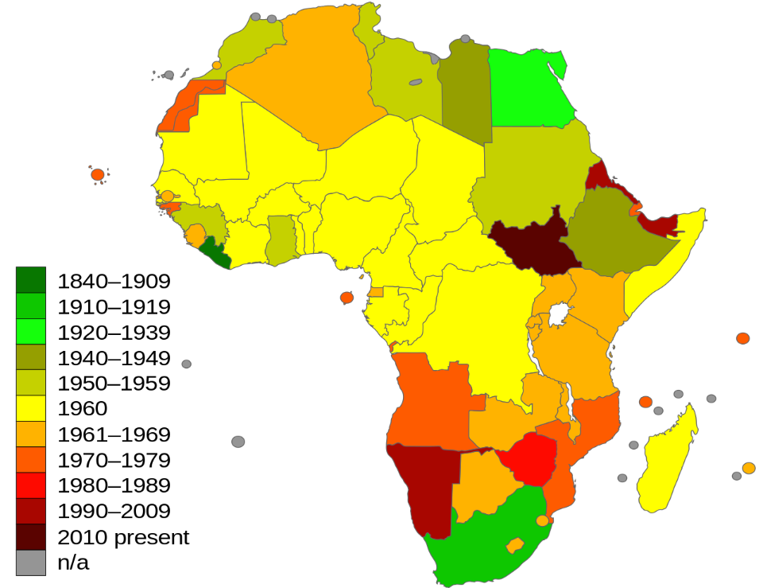

Dekoloniseringen

*Dekoloniseringen er benevnelsen på bevegelsen der de fleste koloniene som de europeiske stormaktene hadde kontrollert som følge av ny-imperialismen, fikk, ihvertfall formelt sin uavhengighet.*

## Bakgrunn for løsrivelsene
Bakgrunnen for dekoloniseringen er sammensatt, men den **utløsende faktoren var definitivt på mange vis andre verdenskrig.**

Den ødelegelsen og de påfølgende økonomiske konsekvensene av dette førte til at mange av de europeiske stormaktene ikke lengre hadde sterk nok økonomi til å fortsette å forsvare sin suverenitet til sine verdensomspennede imperier.

Det hadde også vært en voksende nasjonalistisk bevegelse i mange av koloniene siden slutten av første verdenskrig, som kjempet mot sine koloniherrer.

Den politiske oppslutningen i f.eks. storbritannia hadde også gått bort ifra å bruke resurser på å ivareta koloniveldt. Politiske saker som velferdsstaten fikk høyere prioritet.

USA utøvde også sin innflytelse som stormakt etter andre verdenskrig over de europeiske maktene for å få igang dekoloniseringen. Det tros at dette var delvis på idealistisk grunnlag, og delvis på komersielt grunnlag, da USA ønsket tilgang til de store markedene som europerne til nå hadde hatt monopol over.

## Forløp

**For britiske kolonier skjedde avkoloniseringen uten mye kamp**, da mest pga. Storbritannias manglende intresse i å beholde sine kolonier.

**Frankrike var blant de som brukte mest makt i kampen om å få beholde sine kolonier**.

### FN
FN opprettet allerede i 1945 et organ som jobbet mot dekolonisasjon, og i 1960 ble det vedtatt en FN resolusjon som erklærte uavhengighet for koloniene og dets folk.

### Videre forløp
På tross av FN organets jobb, og økende internasjonal oppsluttning om dekoloniseringen forble de fleste koloniene ufrie utover 1940- og 50-tallet.

Etter resolusjonens vedtak ble de fleste koloniene uavhengige. Men pga. den raske overgangen ble mange av koloniene forlatt av koloniherrene i kaos, og uten noen ordentlig form for styreform eller statsapparat. Et av de verste eksemplene på dette var Kongo, som ved sin uavhengighet hadde **16 borgere som hadde universitetsutdannelse.** Dette rotet og forhastede uavhengigheten har ifølge mange fått alvorlige konsekvenser for de tidligere koloniene.

Selv om koloniene fikk sin formelle selvstendighet forble mange svært avhengige av sine tidligere herrer. Ifølge mange etablerte dette en ny for for imperialisme/kolonisme som kalles neo-imperialisme eller neo-kolonisme. Det siktes da til den mer indirekte makten stormakter utøver over 3. verdensland ved hjelp av de økonomiske ulikhetene som skiller landene.

#### Dekoloniseringen av afrika
