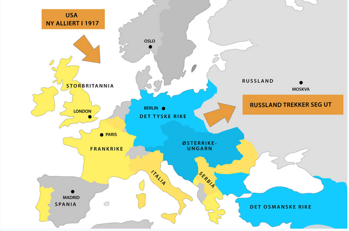
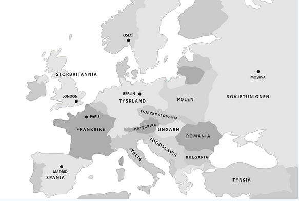

Første verdenskrig

## Bakgrunn
Første verdenskrig hadde sin bakgrunn i de europeiske maktenes kamp om kolonier og makt, altså nasjonalisme. 

### Maktpolitikk, nasjonalisme og imperialisme
Tyskland hadde ambisjoner om å kontrollere større deler av vest og sentral Europa. Og det ble drevet systematisk arbeid i skolevesenet for å indoktrinere barn og unge med en følelse om at Tyskland hadde rett på mer enn det de hadde. De hadde også kommet sent inn i konkuransen om kolonier(ref. Berlinkonferansen). **Klare trekk til nazistenes retorikk(tysk storhet).**

Frankrike på sin side var forbrittret over sine tap om det som skulle bli det tyske riket i 1871, og ønsket å ta tilbake de landområdene som de hadde tapt.

**Russland hadde ambisjoner om en panslavisk stat**, med Russland som styrende makt. Dette var på kant med Østerike-Ungarn, som på denne tiden kontrolerte store slaviske området i Øst-Europa.

**På grunn av disse politiske forutsettningene foregikk det også en enorm opprustning av krigsflåter og våpen.** De europeiske maktene økte sin pengebruk på **våpenproduksjon med 50%** i årene rett før krigens utbrudd. Godt forsynt av teknologi som kom fra den industrielle revolusjonen. Bak dette våpenkapløpet kan vi igjen se klare nasjonalistiske trekk.

Kamp om enkelte kolonier i tidligere tiår hadde også økt den politiske spenningen i årene før.

### Balkankrigene (1912-1913)
Helt siden 1800-tallet hadde folkegrupper på Balkan kjempet for frihet fra det osmanske riket. I 1912 førte dette til at en allianse av Hellas, Bulgaria og Serbia seiret over det osmanske riket på Balkan. Da det osmanske riket hadde styrt balkan i nært 500 år var ikke grensene til de nye nasjonstatene klare og etterfulgt av seieren fulgte kamper og konflikter om teritorier på balkan. **Den Serbiske grupperingen kom svært godt ut av denne striden og ønsket å etablere et Stor-Serbia.** **Dette bekymret det Østerike-Ungarske riket som hadde egne interesser på balkan, og disse motsettningene var bakgrunnen for skuddene i Sarajevo**, som igjen var den utløsende hendelsen for første verdenskrig.

## Alliansene
Samlingen av Tyskland under Otto von Bismarck, og det Tyske rikets allianse med Østerike-Ungarn følte til en kraftig forstyrrelse av maktfordelingen i Europa. På denne tiden var maktfordelingsprinsippet en viktig byggesten i den europeiske politikken. De 3 stormaktene var da Frankrike, England og Russland, disse opprettholdt en balanse i maktforholdene, og ga slik en hvis stabilitiet. Men med inntoget av den Tysk/Østerrik-Unarske alliansen(som Italia ble en del av i 1882) ble balansen forstyrret, og de 3 gamle stormaktene så seg truet av det nye politiske bildet.

Som et svar på dette gikk Frankrike inn i en allianse med Russland, Storbritannia ble en del av denne rett før år 1900. Håpet var at denne alliansen ville avskrekke Tyskland fra å starte en tofrontskrig.

Alliansen mellom Tyskland, Østerike-Ungarn og Italia ble kalt **Trippelalliansen**, og senere **Sentralmaktene**.

Alliansen mellom Frankrike, Russland og Storbritannia ble kalt **Tripelententen**.

Alliansene ble satt på prøve i konflikter i Marokko og på Balkan.

## Skuddene i Sarajevo
Med bakgrunn i gnisningene mellom Østerike-Ungarn og Serbia drepte en Serbisk nasjonalist tronearvingen til den Østerisk-Ungarske tronen i 1914. Østerike-Ungarn antok at den Serbiske staten var ansvarlig og krevde at de nedkjempet de Østerisk-Ungarsk fientlige gruppene i Serbia. Tyskland støttet dette ultimatumet som ga Serbia 48 timer før Østerike-Ungarn ville gå til militær aksjon mot Serbia. Russland støttet Serbia, hovedsakelig basert på den delte slaviske arven, og ideen om en panslavisk stat.

Trippelalliansen antok at Russland bare kom med tomme ord, noe han ikke gjorde og tsaren begynte mobiliseringen av militæraparatet.

Da militæraparatene var enorme maskineri som tok lang tid å få igang var de vanskelig å stoppe når de først hadde startet, mye på grunn av frykt om at hvis en part demobiliserte ville de ikke ha tid til å remobilisere før det var for sent.

Dette sammen med de innfløkte alliansene var grunnen til at store deler av europa ble dratt inn i krigen.

## Krigsforløp
	
**USA ble en del av krigen i 1917.**

## Norge i krigen
Kongene i Danmark, Sverige og Norge møtes i Malmø i **desember 1914, der understrekte de ønsket om å verne om en felles nøytralietet.**

De kjempende maktene hadde i utgangspunktet ingen grunn til å dra de nordiske landene inn i krigen. Men Norge som hadde verdens fjerde største, og var slik viktig for transport av varer som var nyttig for krigen.

Opinionen i det norske folket var også for nøytraliet. Norge hadde på denne tiden tradisjonelle bånd til Storbritannia, men også sterke kulturelle og politiske bånd til Tyskland. Opinionen begynte utover krigen å svinge mer og mer i favør for de vestlige maktene, mest pga. de norske tapene av handelsskip til de tyske ubåtene. Tapene økte mye etter Tysklands deklarasjon om full ubåtkrig i 1917.

Norge var avhengig av kulltilførsel fra Storbritannia. Norge eksporterte også store mengder råvarer til den tyske våpenindustrien, samt solgte sild til dem. Storbritannia utnyttet denne situasjonen, og tvang Norge til å stanse sildsalget, og ellers begrense råvarehandelen med Tyskland. Store deler av den norske handelsflåten ble etter dette også satt til disponisjon til britene.

### Norsk skippere = krigsprofitører
Norske skipsredere tjente seg søkkrike da konkuransen fra de tyske og britiske handelsflåtene forsvant.

### Utfall etter krigen
Mangelen på importvarer førte til en utbyggning av industrien, jordbruket ble også utbygget og effektivisert. Norge økte på denne måten selvbergningsevnen. **Og utbyggningen av industrien, sammen med mangelen på konkuranse gjorde de norske varene mer atraktiv.**

Den engelskvennlig holdningen, og fiendtlige holdningen mot Tyskland holdt seg helt til andre verdenskrig, og hadde store virkninger på krigens løp for Norge.

## Fredsforhandlingene
Russland led tap mot Tyskland, og etter den kommunistiske revolusjonen valgte de å søke fred med Tyskland, våren 1918 gikk de inn i en separatfred med Tyskland. Russland måtte da avgi store områder i vest til Tyskland. Etter den russiske revolusjonen løsrev også Finnland seg ved en borgerkrig.

Tyskland inngikk selv en våpenhvile med entenene den 11. november 1918. Dette på grunn av folks misnøye med matmangelen og pga. flere revolusjoner som hadde blusset opp innad i keiserriket.

**Seiersherrene forhandlet fredsavtaler individuelt med hver av partene som led nederlag**. Den avtalen som ble forhandlet frem for Tyskland heter Versaillestraktaten.

Seiersherrene hadde splittende syn på hvilken fredsavtale de ønsket. Franskmenne ønsket et komplett avrustning av Tyskland, avståelse av land og giganterstatning til for ødelegelsene som hadde funnet sted på Fransk jord. Storbritannia hadde mindre ekstreme krav, men også de var under svært hard press av opinionen av befolkningen hjemme. USA under ledelse av Wodroe Wilson forsøkte å få til en mer balansert fredsavtale, og med den intensjonen framsatte USA 14 punkter som skulle legge føringer for forhandlingene.

USA mente også at store statsaparat som Østerike-Ungarn, det osmanske riket osv. skulle deles opp, og befolkningsgruppene skulle få selvstyre. Med andre ord ville han gjøre **nasjonstaten til gjeldene styreform i Europa.**

**Grunnsynet for forhandlingene var at Tyskland hadde fullstendig skyld for krigen, og skulle straffes hardt.**

### Versailletraktaten
I 1919 møttes partene for å forhandle det som skulle bli Tysklands fredsavtale i Paris.

Tyskland forventet i utgangspunktet at de skulle få en avtale som bygget på forsoning og et ønske om å bygge opp Europa i fellesskap. Det de fikk var det motsatte, Tyskland måtte ta på seg det fulle ansvaret for krigen, store områder skulle avståes til Polen i øst, og det samme skulle områdene Tyskland hadde tatt til seg i 1871 fra Frankrike, og Danmark fikk sør-Jylland, områder skulle også avstås til den nye staten Tjekkoslovakia. Koloniene skulle fordeles mellom seiersherrene. Hæren skulle også bygges ned til maks 100 000 mann, noe som ikke utgjorde noen fare mot seiersherrene, men var tilstrekkelig til å **nedkjempe interne revolusjoner, de var redde for en kommunistisk opplussning i Tyskland.** Tyskland skulle heller ikke ha flyvåpen, noe vitner om deres framsyn om at luftvåpen ville bli viktig? Områdene mot Frankrike ble avmilitarisert. Tyskland skulle også betale gigantiske krigserstatninger på 6,6 milliarder pund, på tross av at økonomien ders lå i ruin.

### Østerike-Ungarn
Østerike-Ungarn ble delt opp til nasjonalstatene Østerike og Ungarn, de nye statene Tjekkoslovakia og Jugoslavia ble også opprettet.

### Det osmanske riket
Det osmanske riket hadde gått inn i krigen med håp om å få kontroll over store områder i Kaukasus, men de ble slått av både russerne og britene. Riket ble i tråd med USAs overordnene mål oppløst, der kjerneområdet ble til den morderne nasjonalstaten Tyrkia.

## Folkeforbundet
For å hindre /////////////