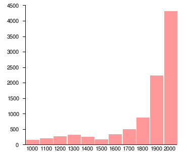
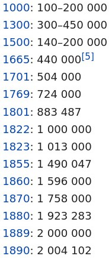
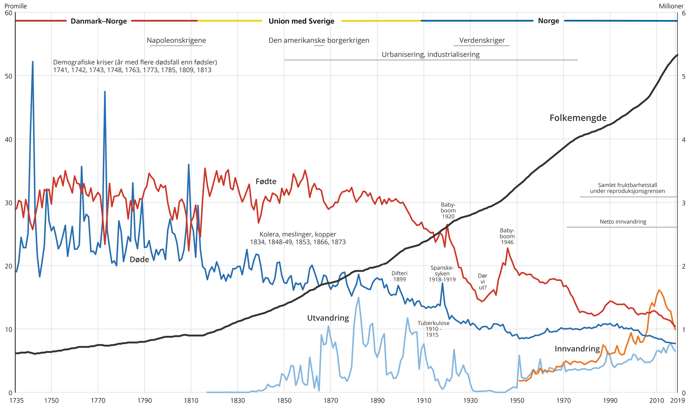

Samfunnsmessige utviklinger 1500-1800

## Befolking
Etter at svartedauden hadde tatt livet av godt over halvparten av befolkningen på 1350-tallet tok det helt til starten av 1600-tallet før befolkningtallet var på sammen nivå.

Pestepedimier, altså etterdønningene etter svartedauden var også med på å holde folketallet nede helt frem til midten av 1600-tallet

Etter midten av 1650-tallet begynte folketallet å vokse så høyt at ressursene måtte fordeles mer og mer. Dette førte til en ordning der gårder ble delt opp i mindre gårder slik at alle arvingene i familien skulle ha noe å leve av. Da gårdene etter hvert ikke ble store nok til å leve av begynte folk å se seg etter ekstraarbeid, og vi fikk med andre ord en økning i tilgjengelig arbeidskraft i landet. Dette sammenfalt med fremveksten av trelasthandelen, bergverksindustrien, fiskeindustrien osv.

## Fremvokst av markeder
Den økonomiske veksten som bidro til at folk ikke lenger kun produserte til selvberging, men også hadde overskudd, førte til fremvoksten av større markeder. Fremveksten av trelasthandelen, jernverkene osv. var også knyttet til denne nye økonomien som vokste frem.