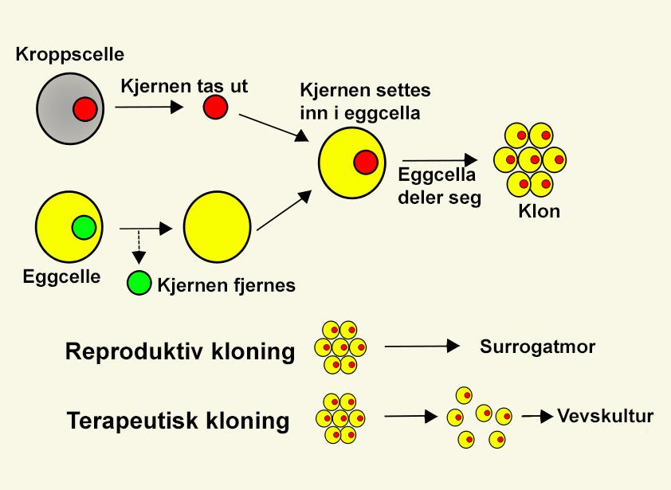
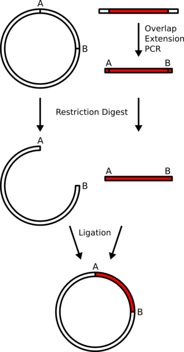

Kloning (Biotek. i praksis)

*Kloning defineres som reproduksjon, der hvert som individ som lages har likt arvestoff som opphavsindividet. En samling med individer som har likt arvestoff kalles derfor for kloner.*

## Typer kloning

### Naturlig kloning
Kloning foregår helt naturlig hos mange organismer. F.eks. vannlopper reproduseres ved kloning, det gjør også planter som poteter og jordbær.

### Reproduktiv kloning ved kjerneoverføring
Reproduktiv kloning foregår ved at man tar kjernen med arvestoff fra en celle til det individet man ønsker å klone, og så skyter denne inn i en eggcelle som man har fjernet kjernen fra. Eggcellen får så et elektrisk støt for å sette igang delingsprosessen, den settes inn i en livmor hos en sourugat, og eggcellen vil da begynne å dele seg som en normalt befruktet eggcelle.

Et vikig steg i å gjennomføre reporduktiv kloning er å få aktivert alle genene i kjernen. Vanligvis blir gener daktiver etter hvert som celler deler og spesialiserer seg, og **for å begynne utviklingen fra et befruktet egg til blastocyst osv. må alle genene være aktive.**

#### Ikke en fullstendig klone
Ved å benytte denne teknikken vil ikke individet bli helt likt donoren. **Mitokondrien, altså cellens energiverk inneholder eget arvestoff**, og dette vil det klonede individet arve fra eggdonoren.

### Alternativer til kjerneoverføring (Embryosplitting)
Et alternativ til kjerneoverføringsteknikken er å ta celler på 8-cellestadiet og overføre dem til sourogat livmorer. Disse cellene vil da utvikle seg normalt videre og gi identiske individ.

**Denne teknikken brukes mye når man krysser individer med svært gode egenskaper**, og sørger for at man får så mange individer som mulig med disse egenskapene. Denne metoden efektiviserer med andre ord den eldgamle prossesen med kunstig utvalg.

### Terapautisk kloning
Når celler fra blastocyster, altså **pluripotente stamceller** benyttes til behandling kalles det **terapautisk kloning**.

Det jobbes med teknikker for å bruke pasienters egne gener til å produsere celler og organer som kan brukes til f.eks. transplantasjon. **Man vil med denne teknikken unngå problemer med at kroppen avstøter organer som den får fra donorer.**

### Molekulær kloning
Ved molekulær kloning klones kun det genet man ønsker. Et enzym henter dette genet ut av den cellen med den ønskede egenskapen. Dette genet blir så satt inn i vector, som er en kunstig etterligning av et **plasmid**. Denne vektoren blir så plasser sammen med en bakterie, *e.coli* bakterier brukes ofte siden de lett tar opp plasmider. Gjærceller kan også brukes. Vertsbakterien reproduserer seg fort og man får slik raskt mange kopier av det samme genet.

#### Bruksområder
Molekulær kloning har i hovedsak 2 bruksområder:
+ Man klipper ut genet for f.eks. insulinproduksjon og fører dette inn i en bakteriecelle. Denne produksjonsmetoden er billigere, og gir renere produkt enn tidligere metoder. Man kan produsere alle slags proteiner på denne måten, også f.eks. veksthormoner eller testosteron.
+ Hvis man har ett eksemplar av et gen vil man gjerne kopiere dette til mange slik at man lett kan studere og forske på det. Det er også nyttig i kriminaletterforskning.

#### Eksempel på fremgangsmåte

