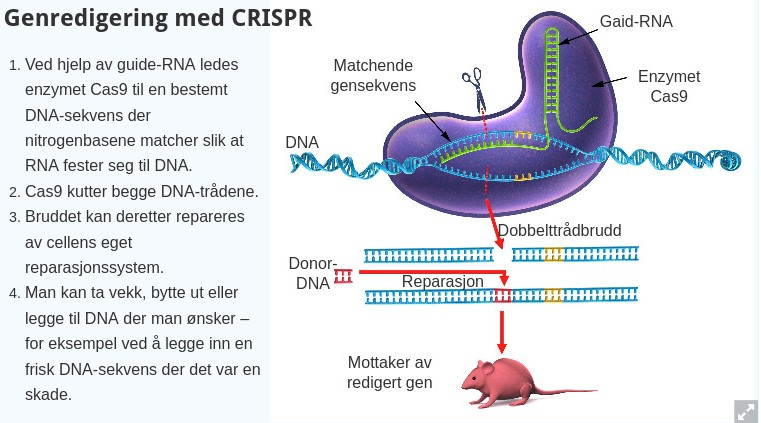

Verktøy for genmodifikasjon

# Tradisjonelle
De tradisjonelle metodene for å redigere arvematerialet til celler har vært restriksjonsenzymer som kutter, og ligaser(en type enzymer) som har limt sammen DNA-et igjen.

Restriksjonsenzymer finnes naturlig i bakterier.

Problemet med disse restriksjonsenzyene er at de kan søke etter spessielle sekvenser på DNA-et, men  da et genom kan være enormt langt kan det oppstå flere kutt, og redigering blir slik lett unøyaktig.

# CRISPER
CRISPER er en ny teknologi for generedigering, og den store fordelen er hvor nøyaktig teknikken er.

CRISPER benytter et syntetisk guide-RNA som finner det nøyaktige stedet hvor vi ønsker å klippe DNA-et. Klippeenzymet(Cas9) finner så dette guide-RNA-et og klipper begge DNA trådene nøyaktig der hvor forskerne vil. Sammenlimingen av DNA-et blir foretatt av cellens eget reperasjonssystem.

## Praktiske anvendinger av CRISPR
CRISPR har sett noe praktisk bruk innen genmodifisering av dyr i bla. USA. Der har de modifisert genene til griser slik at de blir motstandsdyktige mot PRRS sykdommen, som årlig tar livet av mange griser rundt omkring i verden.

### Laks i Norge
I Norge har bruk av CRISPR så langt holdt seg til forskningslabbene. Men det forskes på bla. bruk av genmodifisering for å gjøre laks resistente mot lakselus.

### Bruk hos mennesker
CRISPR har så langt ikke blitt brukt på mennesker i noen stor grad. Men det forskes på bruk av teknologien til terapautiske formål, som f.eks. behandling av kreft.