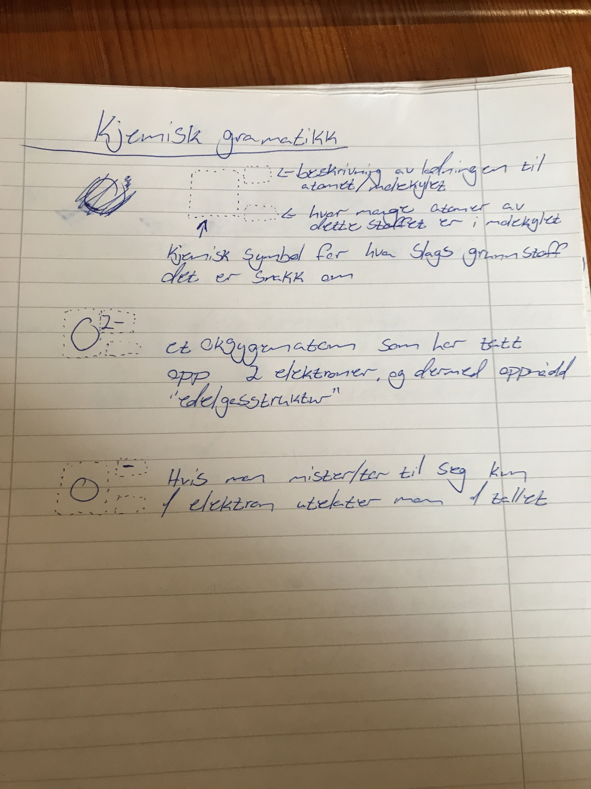

Redoksreaksjoner

# Selve reaksjonen

## Tommelfingerregler for redoksreaksjoner

- Når metaller og ikke-metaller reagerer skjerdet en komplett elektronoverføring, altså en ekte redoks reaksjon
- Når metaller reagerer med ikke-metaller er det enkelt å vite resultatet, det vil altid være et salt(f.eks. Natriumklorid NaCl). Vanskeligere å vite resultatet når 2 ikke-metaller reagerer.
- Metaller blir ikke negativt ladet i en redoksreaksjon
- Ikke-metaller finnes vanligvis i parvise gassmolekyler, f.eks. O~2~ og H~2~
- Metaller finnes vanligvis i fastform i "enkelt" atomer, f.eks. Pb(bly), Au, Ag osv.
- Det er vanligvis lettest å begynne å balansere en redokslikgning på reduksjonssiden

# Elektrolyse
Elektrolyse er det som skjer når vi fører elektrisitet igjennom en elektrolytt. Det vil da oppstå en kjemisk reaksjon ved elektrodene hvor ionene i elektrolytten enten gir fra seg eller tar til seg elektroner fra elektrodene. På grunn av den elektromagnetiske tiltrekningskraften vil de negativt ladede ionene trekke til den positive elektroden, og de positive ionene trekke til den negative elektronen.

Ved f.eks. elektrolyse av vann kan man da ha 2 sylindre med hver sin elektrode, sylindrene kobles sammen slik at elektrolytten(vann) kan flyte fritt. Siden reaksjonen skjer ved elektrodene kan vi da samle de rene stoffene Hydrogen og Oksygen ved hver av sylindrene.

Under elektrolysen vil elektroner trekkes til den positive elektroden og taes opp, denne elektroden kalles en anode, siden det foregår en oksidasjon der. Ved elektrolyse av Vann er det hydrogenatomene som trekkes til anoden.

### Elekrisitet, salt og vann

Saltvann leder elektrisitet, men hverken salt i fast form eller sterilt vann vil lede elektrisitet. Nøkkelen til å forstå dette er at natrium og clor ionene i salt kan transportere elektroner mellon elektrodene i saltvannsløsningen. Med andre ord de kan flyte fritt mellom den positive og negative elektrodene, og slik frakte elektroner mellom elektrodene. Vann derimot inneholder ingen ioner og består av sterke elektrondelingsbindinger som ikke kan spaltes veldig lett. Sterilt vann har derfor ingentil som kan lede elektronene mellom elektrodene. Salt på den andre siden har ioner som kan transportere elektroner, men disse ionene er fastlåst i en krystallstruktur, og kan derfor ikke forflytte seg mellom den positive og negative elektroden.

# Galvaniske celler

En galvanisk celle består av 2 halv-celler. Hver halv-celle består av en elektrode og en elektrolytt. Halvcellene holdes separat for og hindre direkte flyt av elektrisk energi innad i cellen, og vi får derfor et elektrisk potensialforskjell mellom de to halv-cellene. Den siste delen av en galvanisk celle er saltbroen som passer på og holde potensialforskjellen mellom de to halvcellene lik null. Hvis vi ikke hadde hatt saltbroen ville det vært en oppbygning av positive ioner på anodesiden og en oppbygning av negative ioner på katodesiden, og reaksjonen ville da fort opphørt pga. potensialforskjellen. Saltbroen avgir negative ioner til den siden som tar opp elektroner, altså anoden, altså det mest uedle metallet. Og det motsatte skjer på katodesiden.

## Katode og anode
En katode er i elektrokjemien den elektroden hvor det foregår en reduksjonsreaksjon, altså den elektroden som tar opp elektroner.

En anode er den motsatte elektroden, altså hvor det foregår en oksidasjonsreaksjon, altså hvor det blir avgitt elektroner.

## Batterier

## Andre praktiske bruk av galvaniske celler
 ### Offeranode
 En offeranode brukes ofte på skip med metallskrog. I spenningsrekka strekker mettallene seg fra de edle, som er de som har minst reduserende egenskap, det vil si minst villig til å gi fra seg elektroner slik at potensialet i det andre stoffet minker. I den andre enden av spenningsrekka finner vi de mest uedle metallene, det vil si de som er mest villig til å gi fra seg elektroner til de stoffene de reagerer med. I en galvanisk celle vil da edle metaller kalles en katode, og vil gi fra seg elektroner til elektrolytten. Uedle metaller kalles anoder, og vil ta til seg elektroner. Og på grunn av dette vil det uedle metallet løses opp fortest. På båter benyttes derfor en zinkklump som en offeranode ved at den kobles sammen med skroget med en elektrisk forbindelse, og siden sink er mer uedelt en både stål og aluminium vil den løses opp fortest og beskytte skroget mot korrosjon.

