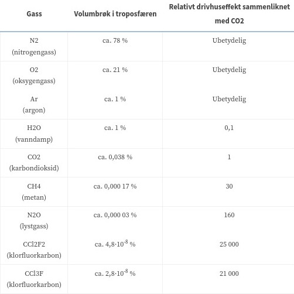
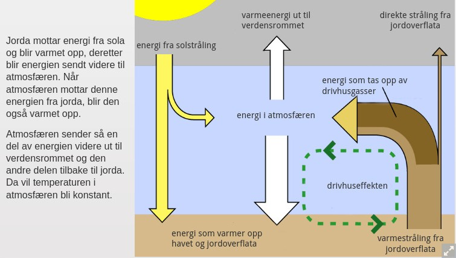

Global oppvarming/Klimaforandringer

# Drivhuseffekten

Det vi kaller drivhuseffekten er effekten hvor gasser i atmostfæren slipper igjennom solstråler som varmer opp jorden, men gassene stopper disse varmestrålene fra jordoverflaten og holder dem inne i atmosfæren.

Side månen ikke har noen atmosfære kan temperaturen om dagen være 100C og om natten 150C.

Vanndamp er ironisk nok den gassen som er den største bidragsyteren til drivhuseffekten.

## Hvorfor går energien inn men ikke ut?
Energien som solen sender mot jorden kommer for det meste i synlig lys. Atmosfæren vår absorberer ikke noe særlig synlig lys, og denne strålingen går derfor igjennom og blir absorbert av jordoverflaten og havene. Denne energien slipper så jordoverflaten fri igjen, men denne typen stråling blir stort sett helt absorbert av atmosfæren, og forblir slik her på jordkloden.

Dette er selvsagt en svært forenklet modell av drivhuseffekten og klimasysteme på jorden, energi overføres også som f.eks. vanndamp fra havene osv.

## Selvregulerende
Dette klimasystemet som drivhuseffekten er en del av fungerer litt som et selvregulerende system(slik vi lærte om i reguleringsteknikken) hvor settpunktet reguleres ved bla. hvilke gasser som finnes i atmosfæren.

# Havnivå
Endring av havnivået er en av de store og potensielt svært alvorlige konsekvensene av global oppvarming. Havet spiller åpenbart en kollosal rolle i mange av økosystemene på jorden, og en forstyrelse i havnivået vil få enorme konsekvenser. Disse konsekvensene vil kunne ramme mennesker spesiellt hardt, da store deler av verdens befolkning og befolkningsentre ligger ved kystlinjen, og store deler av deres livsgrunnlag(økonomi, mat osv.) er tett knyttet til havet.

## Prosjekterte endringer i havnivået
Hvis vi mennesker holder oss på det nåværende nivået med forbruk av fossile brenngasser og utslipp av drivhusgasser, antar forskerne at havet vil stige med 30 cm iløpet av tiden frem til år 2100.

Hvis derimot økningen i utslippene, slik vi har sett de siste tiårene, fortsetter har enkelte forskere kommet frem til at havnivået kan øke med så mye som 5 meter!!

### Usikkerhet knyttet til spådommene(ref. kaosteori)
Alle slike spådommer om fremtidig endring må dog taes for det de er, nettopp spådommer. De er riktig nok beregnet basert på vitenskapelige data og metoder, men klimaet på jordkloden er et veldig fintfølsomt, sammenvedt og komplekst system. Det er derfor vanskelig for klimaforskere å bygge modeller som representerer den sanne virkeligheten, og små forskjeller mellom modellene klimaforskerne benytter og det faktiske systemet kan gi store forskjeller i sluttresultatet.

Et eksempler på dette er f.eks. at når innlandsisen smelter vil det naturligvis bli mere vann i havene, og man vil da naturligvis anta at havnivået vil stige, men man må også tenke på at når innlandsisen smelter letter det på det enorme trykket som presser ned landmassen isen lå oppå. Kystlinjen vil derfor også flytte på seg pga. at landmassen stiger, og det vil påvirke andre landmasser, ved at landmassen som stiger vil påvirke mengden vann den forflytter når den beveger seg oppover.

Et annet eksempel er at økt temperatur i havet kan føre til flere skyer, som igjen vil reflektere sollys, og derfor bidra til å minske den totale mengden energi jordens klimasystemer tar opp fra solen.

# Antarktis

Vintertemperaturene i Antarkis har økt med 3-4C iløpet av de siste 50 årene. Isen har også blitt målt til å være 45% tynnere idag enn den var for 40 år siden. Og det virker som om endringene øker eksponensielt. Smelingen av isen frigir store mengder ferskvann, som igjen forstyrrer saltbalansen i vannet rundt, som igjen påvirker økosystemene i vannet.

Når store områder som tidligere hadde helårsdekkende is nå er isfrie i perioder øker også absorbsjonen av energi fra solen. Dette fordi is og snø reflekterer det meste av sollyset som treffer det, mens havet absorberer mye mer av energien og lagrer den som varme. Dette er med på å akselerere oppvarmingen.

# Permafrost
Permafrost er betegnelsen på bakken som forblir frosset året rundt, altså tele året rundt. I Norge har vi permafrost både på høyfjellet og noen steder i Finnmark. Også selvsagt på Svalbard, hvor permafrosten rekker så dypt som 400 meter. Om sommeren kan de første metrene tine, men under det er bakken frossen, og det kalles fortsatt permafrost. Permafrost kan vi også finne i store deler av Kanada, samt i Sibir, hvor den kan nå så dypt som hele 1500 meter under bakken.

Mye infratruktur i f.eks. Sibir er bygget på permafrosten, og bruker den som et fundament da den er veldig stabil. Hvis permafrosten dog smelter vil både boligblokker, rørledninger, veier osv. få store problemer.

### Utslipp av metan mm. ved tining
Organisk materieller som ligger begravd i permafrosten blir bevart, da mikroorganismer som står for råtningsprossessen ikke kan gjøre jobben sin der. Når permafrosten da tiner vil råtningsprossenen starte, og hvis prosessen foregår uten god nok tilgang på oksygen vil det kunne produseres store mengder metan og CO~2~. Sett fra tabellen ovenfor ser vi at metan har 30 ganger drivhuseffekten til CO~2~.

# Politiske vedtak angående klimaforandringene

### Faktorer som minker den politiske slagkraften
Et problem som gjør det vanskelig å få gjenomført politiske vedtak ifm. klima er tidskalan som politikken arbeider på sammenlignet med klimaet. De utslippene av drivhusgasser vi har idag vil forbli i atmosfæren i over 100 år, for å få bukt med mange av problemene som klimaendring drar med seg må vi dog gjøre endringer nå. Det sier seg selv at det derfor er vanskelig å få gjenomslagskraft for vedtak som vi først vil se store direkte resultater av i en fjern fremtid.

### Kyotoavtalen/-protokollen av desember 1997
Kyotoavtalen hadde som hensikt å fastsette en plan for å kontrollere utslippene på et internationalt nivå. De fleste industriland bandt seg til å redusere sine utslipp, mens noen land fikk muligheten til å stabilisere sine utslipp, mens andre land igjen fikk mulighet til å øke sine utslipp. Et mål for avtalen var at den skulle ratifiseres av land som tilsammen stod for 55% av verdens utslipp. Dette ble en realitet i 2004(eller 2005?), dette på tross av at land som Australia og USA trakk seg fra avtalen.

Et av systemene kyotoprotokollen etablerte var et system for kvotehandel, hvor kvotene skulle representere utslippskutt, og land kunne ved å kjøpe disse kvotene få utslippskuttene fraskrevet som kutt i egne utslipp. Denne ordningen har i ettertid dog fått til dels sterk kritikk pga. mange svikt i systemet som førte til at kvoter ikke representerte reele kutt i utslipp. ref. SNL.

### Parisavtalen anno 2015
Parisavtalen var den første juridisk bindene avtalen som fikk nær globalt omspenn. Hovedformålet med avtalen er å holde temperaturendringen iløpet av det først århundre i 2000 tallet på jorden under 2C, og helst under 1,5C. Referansetemperaturen som brukes er fra førindustriell tid. De andre generelle temaene som avtalen omhandler er å forme globale økonomiske strømmninger slik at de er forenelige med lave utslipp og klimarobuste utviklinger. Altså gjøre det mer lønnsomst å drive klimavennlig økonomisk aktivitet.

Målet for det andre århundret er å oppnå en ballanse mellom utslipp og opptak av klimagasser.

Ifølge avtalen skal land selv utarbeide planer og mål for sine utslipp, og disse planene, samt raportering til det internasjonale samfunnet skal foregå i en 5 års syklus. 

Avtalen sier også at de mer velstående landene skal gi finansiell støtte til mindre velstående og utviklede land slik at de kan implementer utslippsreduserende og klimarobuste tiltak.

Da det ikke er satt noen faste utslippstall som land skal oppnå er avtalen ganske mye "mykere" enn kyotoavtalen, og virker mer som en intensjonsavtale. Det er heller ikke satt noen straff/sanksjoner som skal tre ikraft hvis en nasjon ikke oppnår eller følger de målene og planene de selv fastsetter.