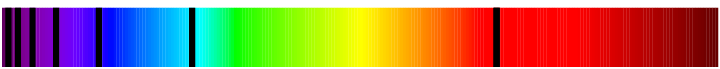

Nordlys og fargespektre

# Lys og atomer
Atomer gir fra seg lys når et elektron hopper opp fra en bane til neste, og straks ned igjen. Grunnen til at elektronet hopper er at atomet har fått tilført energi. Elektronet hopper med en gang ned igjen, og samtidig blir et foton sendt ut av atomet. Energimengden/bølgelengden til dette fotonet kommer ann på hvilke atom som sender det ut, og hvilke baner elektronet hoppet imellom.

Siden hvert atom sender ut et unikt blanding av stråling med forskjellige bølgelengder kan vi bruke et spektrometer til å identifisere forskjellige stoffer. Denne teknikken brukes mye under forskningen ute i rommet. 

## Absorbsjon og emmisjon
Hvis vi viser spekteret til lys som kommer igjennom et materiale vil si se svarte striper i spekteret, dette er de bølgelengdene som absorberes av stoffet, og fungerer som et fingeravtrykk da det er forskjellig fra stoff til stoff.

Hvis et atom blir tilført energi vil elektroner hoppe opp og ned, og slik slippe ut fotoner. Hvis man da gjør det samme som med absorbsjonsspektrumet vil vi se noen få linjer som kommer frem. Disse overlapper perfekt med hullene i absorbsjonsspekteret.

**Vi kan si at begge disse er et produkt av det unike sammensettningen med elektroner i forskjellige energibaner som er unikt for hvert atom.**

## Spektroskopi og Doppler
Pga. Dopplereffekten vil objektet som sender ut elektromagnetisk stråling mot oss få en **blåforskyvning** og objekter som beveger seg vekk fra oss få en **rødforsyvning**. Mengden forskyvning kan også brukes til å måle hvor fort objektet beveger seg fra oss.

# Måling av avstander
Korte avstander til f.eks. månen kan måles med f.eks. radar eller laser.

## paralaksmåling intill 1000 lysår
Man måler en stjernes forflyttning i grader iløpet av et tidsrom, f.eks. 6 måneder. Pga. jordas forflytning og ved hjelp av trigometri kan man da regne ut avstanden til objektet. En forflytning på 1 buesekund iløpet av 6 måneder vil være lik 1 paralakssekund = 3,2616 lysår. Vi kan måle ned til 1/100 buesekund.

## Svært lange avstander
Svært lange avstander kan måles ved intensiteten av lyset vi måler fra stjernen. Vi vet lysintensiteten til de forskjellige kefeidene(typene stjerner), og mengden lys som når oss forteller oss da avstanden.

Dopplereffekten kan også brukes ved Hubbels lov.

# Nordlys