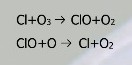

Ozon og UVA-B-C

# UV stråling
UV(Ultra fiolet) kan deles inn i 3 underkategorier, A, B og C. 

### UV-C
UV-C er den typen som inneholder mest energi og har en bølgelengde mellom 100-280nm. UV-C stråling absorberes både i ozonlaget ved å spalte ozonmolekylene til O~2~ + O, og noe av denne strålingen absorberes også i de øvrige lagene av atmosfæren ved å spalte vanlige oksygenmolekyler.

### UV-B
UV-B er den typen stråling som har bølgelengde mellom 280-315 nm. Omtrent 90% av denne strålingen blir absorbert av Ozon-laget, men den resterende 10% når jordoverflaten.

# Ozon

Det vi kaller ozonlaget er egentlig ozonet som finnes i stratosfæren. Stratosfæren er ca. 40km tykk, og hver kilogram av stratosfæreluft inneholder kun ca. 10mg med ozon, altså ca. 0.000001%. Det er altså svært lite som skal til for å beskytte livet på jorden fra farlig stråling.

### Ozon som resultat av smog
Ozon kan også oppstå i fotokjemisk smog fra bla. bileksos. Det vil si at ozon gjerne forekommer i forurensete storbyer.

## Ozon som beskyttende lag
Den mest energirike strålingen, det vil si stråling med bølgelengde mellom 180-240nm blir for det meste absorbert allerede i de første lagene med atmosfære, av de O~2~ molekylene som finnes der.
Denne spaltingen har følgende formel: O~2~ + ultrafiolett stråling → O + O

Bølgene med noe mindre energi, mellom 200-320nm går lengdre inn i atmosfæren, og absorberes for det meste as ozonlaget i stratosfæren. 
Denne spaltingen har følgende formel: O~3~ + ultrafiolett stråling → O~2~ + O

Når disse atomene og molekylene finner sammen igjen får vi tilbake den energien de absorberte iform av varme og noen fotoner med lavere(ufarlig) energi. Dette er grunnen til at stratosfæren kan være varmere enn troposfæren, selv om det er lengre opp.

Stråling med bølgelengde over 320nm har for lite energi for å spalte noen molekyler i atmosfæren, og slipper derfor igjennom til jordoverflaten.

## Måling av ozonlaget

Når vi ønsker å måle mengden ozon i atmosfæren tenker vi oss at vi tar allt ozonet i det området vi vil måle, komprimerer det til trykket og temperaturen(eller 0C?) vi har på jordoverflaten, altså 1 atm, og måler så tykkelsen av det laget vi får. 1 mm vurderes som tynt, og 4 mm vurderes som relativt tykkt. 3-4mm regnes som vanlig/tilstrekkelig. Enheten forskerne gjerne bruker når de snakker om ozonlaget er DU(Dobson Unit), hvor 1mm ganske enkelt er 100 DU.

## Nedbrytning av Ozon(O~3~)
Klorfluorkarbon(KFK) gasser ble i 1987 forbudt siden de bryter ned ozonlaget. Forskning helt tilbake til 1074 tydet på att KFK-gasse var skyld i oppløsningen av ozon-laget. Det tok altså over 10 år før politikerne kom til enighet om å gjøre noe. Montrealprotokollen er det dokumentet som prøver å styre KFK utslippene i verden, og inneholder en plan for å senke utslippene. Kun 5 nasjoner i verden har ikke signert protokollen.

I år 2000 var hullet i ozonlaget på sitt største.

Når KFK-gassen blir sluppet ut i atmosfæren kan et Cl atom spaltes fra gass-molekylet. Dette klormolekylet kan da spalte et ozonmolekyl og binde seg til et oksygenatom for og danne `ClO`. Det kan så løsne igjen og gjenta spaltingen av Ozon i en endeløs sirkel.
