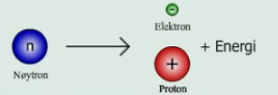

Radioaktivitet

# Partikler og stråling
Det er umulig å forutsi når et atom vil sende ut noen for for radioaktiv stråling, med andre ord er det tilfeldig, og kommer uten noen form for forvarsel. Det eneste vi kan måle er den gjenomsnittelige tiden til mange atomer. Dette kalles halveringstid???

Summen av Alfa og beta stråling partikelens masse og masse til utsenderen er ikke lik orginalmassen, noen masse frigis som energi som bevegelsesenergi til partikelen og gamma-stråling.

## Halveringstid
Halveringstiden er den tiden det tar 50% av en ustabil isotop f.eks. Thorium-234 å brytes ned til et annet grunnstoff, i dette tilfellet Protactinium. 50% av thoriumet vil være brutt ned innen 24 dager. Siden strålingen i enkeltatomer er uforutsiger brukes halveringstid som en slags gjennomsnittsverdi for nedbrytningsfarten.

### C-14
C-14 er en radioaktiv isotop av Karbon som brukes for å datere levninger etter organismer. Organismer slutter å ta opp Karbon når de dør. Og forholdet mellom C-14 og andre C isotoper(hovedsakelig C-12) kan derfor brukes til å tidsfeste dødstidspunktet. C-14 har en halveringtid på 5730 år, som er ganske perfekt for datering av organismer, spessielt menneskelevninger.

## Måling av stråling
Mengden stråling angis i Becquerel som er definert som antall kjernespaltninger per sekund(eller antall partikler, også fotoner gamma). Man snakker vanligvis om Becquerel i store enheter som Mega eller Kilo. Forskjellen fra Becquerel og Hertz er at stråling er probablilistisk og man kan derfor ikke bruke Hertz som enhet.

Man må også regne med den energimengden som blir overført ved eksponering for stråling. Dette måles i Gray eller Gy, som er definert som **Gy = 1 Joul/kg**.

En annen viktig faktor i måling av stråling er hvor konsentrert og hvor omfattende ioniseringen er. Det vi si at selv om man motar lik Gy mengde stråling fra alfa og beta/gamma-stråling vil Alfa strålingen være mye mer konsentrert og forårsake mer omfattende ionisering enn beta/gamma strålingen vil, og derfor forårsake mer skade i mennesker. Dosemåling måles derfor i **Sievert(Sv) som tar høyde for doseekvivalent eller effektiv dose.** Man brukes ofte mSv siden Sv er en stor enhet. Man utsettes til vanlig for ca. **4mSv i året**.

### Dosimeter
Personer som arbeider med ioniserende stråling går vanligvis med et dosimeter. Det er en plastboks med en eller form for photopapir inni. Den byttes ut 1 gang i måneden og måles for den totale strålingen den har blitt utsatt for.

## Alfas-/α- stråling/partikler
Alfastråling består av alfapartikler. Alfapartikler er partikler bestående av 2 protoner og 2 neutroner, de er altså identiske til kjernen i et heliumatom(^4^He^2+^).

Når f.eks. Radium(^226^~88~Ra) utstråler en alfa partikel vil atomet bli til et Radon atom(^222^~86~Rn) siden 2 protoner og 2 nøytroner har sluppet ut av kjernen.

## Beta-stråling/Beta partikler
Betastråling består av betapartikler, og er en type partikel stråling, altså direkte stråling. Betapartikler er elektroner eller positroner som har blitt skutt ut av atomkjernen. Disse elektronene eller positronene kommer fra at et nøytron fra kjernen blir spaltet til et proton og et elektron(et nøytrino partikel kommer også ut av spaltingen ifølge SNL). Det er energien som blir frigjort i spaltingen som gir elektronet energi nok til å bli sendt ut av kjernen. Nøytrino partikelen blir også sendt ut av kjernen.

Når f.eks. Cesium(^137^~55~Cs) sender ut en beta-partikel blir atomet til et Barium(^137^~56~Ba)

## Gamma-stråling(γ)
Gammastråling er ioniserende elektromagnetisk stråling, og i motsettning til alfa og beta stråling er indirekte stråling istedenfor direkte stråling. Og atomet som sender ut strålingen endrer seg ikke.

Gammastråling er den mest energirike formen for elektromagnetisk stråling, og kategoriseres som all EM-stråling over 30EHz, eller all EM-stråling med en bølgelengde mindre enn 10 pm. Denne typen stråling befinner seg med andre ord over røntgen-stråling.

Gammastråler blir sendt ut av atomer når en sammensettning av kjernen med et høyt energinivå endrer sammensetning til en type med laver energinivå. Atomer har ofte dette høye energinivået rett etter at de har sendt fra seg en alfa eller beta partikel. Denne overgangen fra høyt til lavt energinivå kan sammenlignes med elektronene som går opp og ned i energibanene, og da gir fra seg energi iform av et photon.

### Praktisk bruk av gamma-stråling

Et praktisk bruksområde for gamma-stråling er i form av stoffet technetium. Technetium(^99m^~43~Tc) stråler ut veldig små mengder gammastråling(denne isotopen har en halveringstid på 6,02 timer). Mengden gammastråling det slipper ut anses som relativt ufarlig, og man bruker det derfor ofte som sporstoff i nukleiærmedesinske sammenhenger.

## Ioniserende stråling
Ioniserende stråling er stråling som har nok energi til å slå løs elektroler fra atomer, atomene blir da til positivt ladde ioner, derav navnet ioniserende.

Grensen for hva som er ioniserende stråling er difuss, men den går ved UV-stråling. Alt som er over UV stråling i energimengde, altså røntgen- og gamma-stråling er ioniserende.

Det finnes i hovedsak 2 typer ioniserende stråling, direkte og indirekte stråling.

**Direkte stråling** er stråling som etterlater seg spor av ioner i det materialet det passerer igjennom. Det er partikler som står for denne typen stråling, altså alfa(α) og beta() partikler. I praksis er disse partikelene dog ikke farlig for mennesker, da de har svært lav penetrativ kraft.

**Indirekte stråling** er stråling som blir tatt opp av stoffer ved delvis eller total absorbasjon. Denne typen stråling kommer fra EM-stråling som f.eks. røntgen- og gamma-stråling.

## Biologiske konsekvenser
Biologiske konsekvenser av stråling kan deles opp i akutte og langtidsvirkende. De langtidsvirkende effektene er oftest kreft fra muterte celler. Mer akutte effekter er gjerne skade på f.eks. beinmargceller som slutter å produsere blod, spes. hvite blodceller, og immunforsvaret kollapser. Ved svært høye doser skades også hjernen, og akutt død kan intreffe. Fordøyelsessystemet skades også ofte.

Strålemengder helt ned til 1-2 Gy vil føre til akutt kvalme.

Har man overlevd 1 måned etter eksponeringen er sjansen liten for at man dør av akuttvirkningene.

## Stråling i dagliglivet

### Flyreiser
Flyreiser utsetter oss for stråling da det er mindre atmosfære som beskytter oss. En tur fra Oslo til New York vil gi ca. 0,08 mSv. Jo høyere du er desto mer stråling

### Radon
Radongass dannes der det er naturlige Uran-238 forekomster i jorden. U-238 omdannes etter en rekke omforminger til Radium-226(Ra). Radium omdannes så til Radon-222(Rn), som stiger gjennom bergrunnen og kan samles opp i f.eks. kjellere. Faren kommer av at Radon brytes videre ned til faste radiokative stoffer som Polonium-218(Po), Po kan videre degradere til radioaktivt bly iløpet av noen få minutter, som kan bli igjen i lungene våre og dermed komme nær nok cellene til å påføre stråleskader. **Lungekreft**

Kan bruke sensitiv film(sporfilm) som tar opp alfapartikler for å måle nivået av Radon-gass.

100Bq/m^3^ - Bedre lufting og tetting mot berggrunn
200Bq/m^3^ - Maksimumgrense for bolighus
400Bq/m^3^ - Omfattende tiltak, som å føre Radon gass bort ifra husene

### Røykvarslere
En type røykvarslere bruker alfastråling til å detektere røyk. Det brukes da Americum som sender ut alfapartikler. Hvis alfapartiklene da blir absorbert av røyk, vil ikke atomene i luftmolekylene ioniseres i like stor grad, og man kan måle denne forandringen i strømføringen i kammeret.