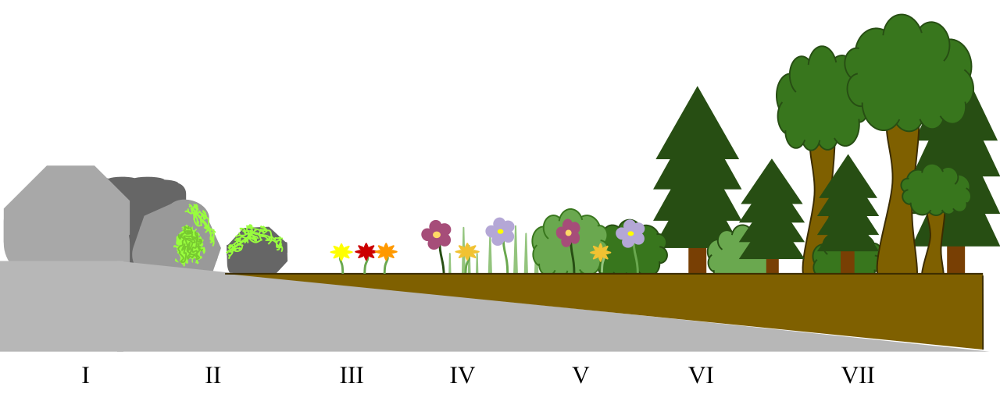
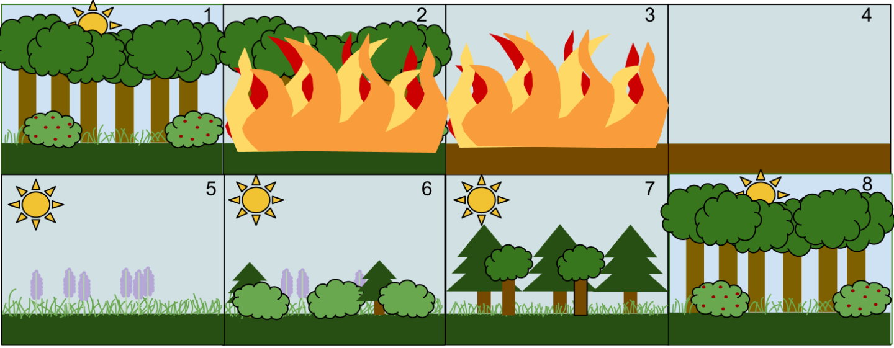

Suksesjon

*Økosystemer går igjennom sene endringsprosseser, disse prossessene kalles **suksesjon**. Vi deler vanligvis suksesjonsprossesene inn i 2 hoved typer, **primær suksesjon** og **sekundær suksesjon**.*

### Abiotiske endringer *(eksempler)*
- Bergrunn forvitrer/eroderer og danner grunnlaget for jordsmonn
- (regn)Vann vasker bort næringsstoffer fra jorden
- Klimaforandringer
### Biotiske endringer *(eksempler)*
- Døde planter tilfører jorden humus
- Barnåler danner sur humus som påvirker pH-verdien i jordsmonnet.
- Plantevekst kan etter hvert fylle/fjerne hele vann/tjern
- Trær som vokser opp kan skygge for deler som tidligere har fått sollys

### Primær suksesjon
**Primær suksesjon** er den suksesjonen som finner sted på et sted, hvor det ikke finne noe liv i det hele tatt. Grunnen til dette kan f.eks. være vulkanutbrudd som dekker området i lava og aske, eller at isbreer trekker seg tilbake. Mindre eksempler på *primær suksesjon* kan være etableringen av mosearter på stein, dette "økosystemet" er da mye mindre i omfang. 

Startetableringen av noen få organismer, ofte enkle organismer er nødvendig for at andre livsformer skal kunne ha noe å livnære seg av. **Konsumenter** trenger **produsenter** å leve av.

*(Bilde: Overgang fra primær til sekundær)*

### Sekundær suksesjon
**Sekundær suksesjon** finner sted enter etter at **primær suksesjon** har jord grunnarbeidet for å etablere et økosystem, eller etter at f.eks. en skogbrann, flathogst eller annen stor forandring i de **abiotiske** miljøfaktorene har ført til en kollaps i det forrige *økosystemet*.

#### Menneskapt sekundær suksesjon
Mennesker påvirker *abiotiske* faktorer som klima. Ved en skogbrann vil økosystemet ofte bare få en restart. Men ved varige endringer som f.eks. klimaendringer vil *abiotiske* faktorer være permantent forandret, og det gamle økosystemet som mennesker ofte er avhengig av vil ikke kunne reetablere seg.

#### Eksempler på menneskapte påvirkninger
- Avrenning av gjødsel til vann og vanndrag, fører til økt vekst av alger og plantevekst
- Klimaendringer som endrer *abiotiske* faktorer som ange arter er avhengige av
- Grøfting av myr som senker grunnvannet (*abiotisk faktor*)
- Hogst av skog

*(Bilde: Direkte sekundær suksesjon)*
