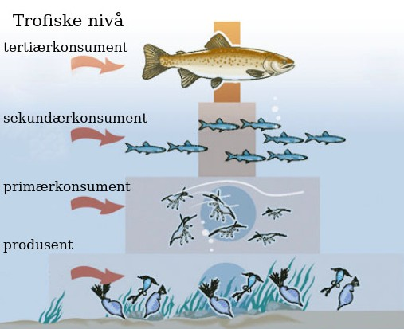

Økosystemer

**Biotiske faktorer** regnoes som alle de levende delene i et økosystem. f.eks. planter, dyr og bakterier.

**Abiotiske faktorer** regnes som alle de ikke levende delene av et økosystem, f.eks. fjell og jord(minus mikroorganismene som lever i jorden).

---

**Økosystem** defineres som alle de levende organismenne som lever på ett sted, samt det miljøet de lever i. 

Økosystemer fungerer som praktiske inndelingsgrupper for å studere et system av organismer og dets miljøfaktorer. Eksempler på *økosystemer* kan være en vannpytt, ett skogsområde eller et havmiljø.

Et *Økosystem* består av både *biotiske* og *abiotiske* elementer.

---

**Autotrofe** organismer er de organismene som henter sin næring fra ikke organiske kilder. I praksis omfatter dette de fleste planter, da de får sin energi og næring fra sol, luft og elementer i jorden.

**Heterotrofe** organismer er de som er avhengig av organisk materiale for å overleve. Dette inkulderer da dyr, mennesker og også **sopp og mange bakterier som fungerer som nedbrytere.**

---

**Næringskjede** er en kjede hvor vi plasserer organismer etter hvem som spiser/tar opp næring fra hvem. De forskjellige nivående i *næringskjeden* kalles **trofiske nivåer**. *Næringskjeder* er **endimensjonale.** Hvert **trofiske nivå** tar opp energi ifra nivået under, det meste av denne energien blir forbrukt av organismen selv til f.eks. celleånding, produksjon av kroppsvarme, bevegelse osv. Det regnes med at i snitt ca **10% av energien som blir overført nedenfra, blir med til neste nivå i kjeden.**

**Næringnett** *næringskjeder* finnes svært sjeldent som uavhengige systemer, og de tar oftests del i et *næringsnett*, det vil si en sammenføyelse av mange forskjellige *næringskjeder*.

**Primærprodusenter** er er de organismenen som omformer uorganisk materiale til organisk materiale. De planteeterne som spiser *primærprodusenter* kalles **primærkonsumenter (trofisk nivå)**. De som igjen spiser *primærkonsumenter* kalles **sekundærkonsumenter**. Nivået over *sekundærkonsumentene* kalles **tertiærkonsumenter**

**Brutto-primærproduksjon** er den totale mengden organisk materiale primærprodusentene produserer. Det som blir igjen etter deres eget forbruk kalles **netto-primærproduksjon**

**Økologiske nisjer** er en beskrivelse på hvilke *biotiske og abiotiske* faktorer en organsime er avhengig av for å overleve, altså hvilke miljø de behøver. Disse behovene kommer frem i artens **interaksjoner** med andre arter.

**Stoffkretsløp** Stoffer har egne *krettsløp* i en økosystem/næringskjede. Og det er ofte viktig for funksjonen av økosystemet at viktige næringsstoffer som f.eks. mineraler og vann ikke blir stoppet opp ved lagring på noen av stegene i krettsløpet. Kretsløpene fører ofte til at enkelte stoffer **akkumuleres oppover i næringskjeden**, dette kan ha farlige konsekvenser hvis stoffer som **kvikksølv eller DDT** kommer inn i krettsløpet. Studie av *kretsløp* i økosystemer er derfor viktig for å forstå konsekvensene av forurensning.

---

**Humus** er organiske forbindelser som ikke kan brytes ned lengre av mikroorganismer. *Humus* er det som gir jorden sin mørke farge. Den er svært viktig i økosystemet, siden det er *humus* som hjelp jord å holde på vann, og den øker også oksygenmettningspotensialet i jorden. **Den er på dette viset viktig for produksjonsnivået i næringskjeden.** Myr og torv er eksempler på forskjellige typer *humus*.
***Les mer om humus!!!***

## Økosystemers robusthet
Noen arter som f.eks. bier spesialierser seg gjerne til å interagere med andre spesifikke arter. Dette gjør dem svært følsome for endringer sammenlignet med mer generaliserte arter.

De største faktorene som tilsier et økosystems evne til å motstå endringer, altså dets **robusthet**, er antallet arter, og hvor mye disse forskjellige artene interagerer. Desto flere arter det er i et økosystem, og desto flere av disse interagerer med mange av de andre, desto mer stabilt og robust blir økosystemet. **Dette er hovedgrunnen til at vi ønsker å bevare jordens bio-diversitet.** *Vi kan derfor si at desto mer sammenknyttet/flere koblinger et næringsnett har, desto mer robust er det*.